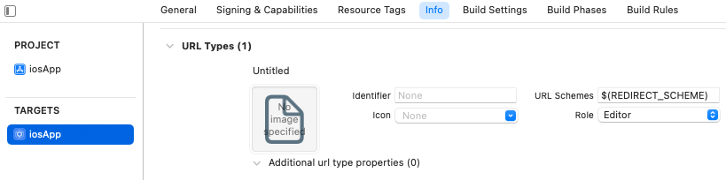

# OpenIdConnectClient for iOS
[](https://github.com/kalinjul/kotlin-multiplatform-oidc/actions/workflows/develop.yml)
[](https://github.com/kalinjul/kotlin-multiplatform-oidc/actions/workflows/main.yml)

Library for using OpenID Connect in iOS Projects. Build with kotlin multiplatform, published for iOS as Swift Package.
This project aims to be a lightweight implementation without sophisticated validation on client side.

- Currently, it only supports the [Authorization Code Grant Flow](https://datatracker.ietf.org/doc/html/rfc6749#section-4.1).
- Support for [discovery](https://openid.net/specs/openid-connect-discovery-1_0.html) via .well-known/openid-configuration.
- Support for [PKCE](https://datatracker.ietf.org/doc/html/rfc7636)
- Simple JWT parsing

# Usage
## Redirect scheme
For OpenIDConnect/OAuth to work, you have to add the redirect uri scheme to your Info.plist.

In XCode, go to your Project -> Target -> Info -> URL Types.
Add your redirect schema (ex. org.publicvalue.multiplatform.oidc.sample)



## Swift package
Add the swift package from https://github.com/kalinjul/OpenIdConnectClient.
If you're using a swift module, add this line:
```swift
dependencies: [
    .package(name: "OpenIdConnectClient", url: "https://github.com/kalinjul/OpenIdConnectClient", exact: "0.3.0")
],
```

## General
Create OpenID config and client:
```swift
import OpenIdConnectClient

let client = OpenIdConnectClient(
    config: OpenIdConnectClientConfig(
        discoveryUri: "<discovery url>",
        endpoints: Endpoints(
            tokenEndpoint: "<tokenEndpoint>",
            authorizationEndpoint: "<authorizationEndpoint>",
            userInfoEndpoint: nil,
            endSessionEndpoint: "<endSessionEndpoint>"
        ),
        clientId: "<clientId>",
        clientSecret: "<clientSecret>",
        scope: "openid profile",
        codeChallengeMethod: .s256,
        redirectUri: "<redirectUri>"
    )
)
```
If you provide a Discovery URI, you may skip the endpoint configuration.

Request access token using code auth flow:
```swift 
let flow = CodeAuthFlow(client: client)
do {
    let tokens = try await flow.getAccessToken()
} catch {
    print(error)
}
```

Perform refresh or endSession:
```swift
try await client.refreshToken(refreshToken: tokens.refresh_token!)
try await client.endSession(idToken: tokens.id_token!)
```

## Custom headers/url parameters
For most calls (```getAccessToken()```, ```refreshToken()```, ```endSession()```), you may provide
additional configuration for the http call, like headers or parameters using the configure closure parameter:

```swift
try await client.endSession(idToken: idToken) { requestBuilder in
    requestBuilder.headers.append(name: "X-CUSTOM-HEADER", value: "value")
    requestBuilder.url.parameters.append(name: "custom_parameter", value: "value")
}
```

# JWT Parsing
We provide simple JWT parsing:
Swift:
```swift
let jwt = tokens.id_token.map { try! JwtParser.shared.parse(from: $0) }
print(jwt?.payload.aud) // print audience
print(jwt?.payload.iss) // print issuer
print(jwt?.payload.additionalClaims["email"]) // get claim
```